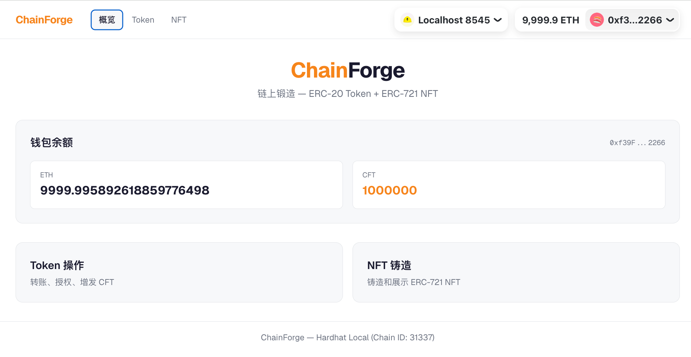
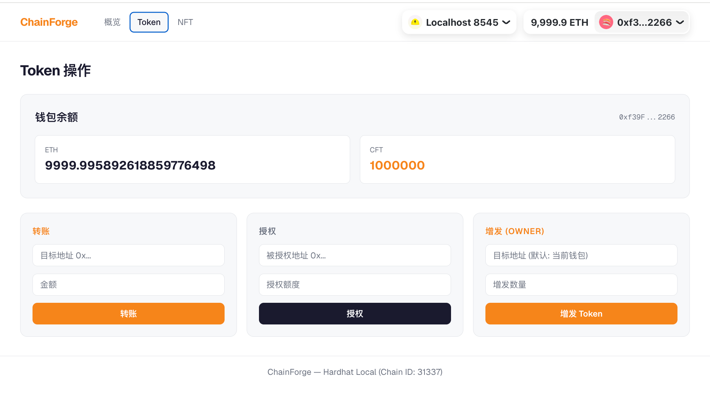
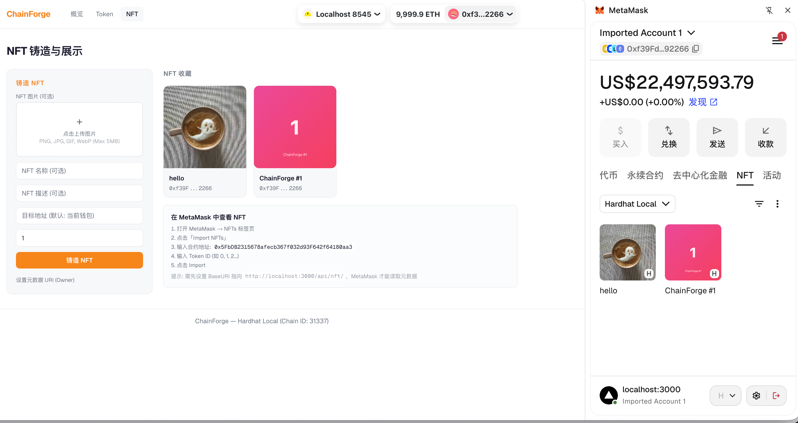

# ChainForge — 链上锻造

> Java 开发者的 Web3 入门实战：ERC-20 Token + ERC-721 NFT + AMM DEX

## 项目简介

这是一个面向 Java 开发者的 Web3 入门项目，通过实战学习区块链开发的核心概念和技能。项目包含：

- 发行自定义 **ERC-20 Token**（同质化代币）
- 铸造 **ERC-721 NFT**（非同质化代币）
- **SimpleAMM** — 简化版 DEX（基于 Uniswap V2 恒定乘积公式 x\*y=k）
- **Java 后端**（Spring Boot + Web3j）与链交互
- **React 前端**（Wagmi + RainbowKit）连接钱包、链上交易

## 架构

```
┌─────────────────────────────────────────────────────────────┐
│                     Frontend (Next.js)                       │
│  Wagmi + RainbowKit  →  useWriteContract / useReadContract  │
│       │              │        │        │                      │
│  MetaMask 签名     链上读取   链上写入   NFT 元数据 API       │
└───────┼──────────────┼────────┼────────┼────────────────────┘
        │              │        │        │
        ▼              ▼        ▼        ▼
┌─────────────────────────────────────────────────────────────┐
│                  Ethereum (Hardhat / Sepolia)                │
│   MyToken (ERC-20)         MyNFT (ERC-721)      SimpleAMM  │
│   transfer/approve/mint    mint/batchMint/URI    addLiq/swap│
└─────────────────────────────────────────────────────────────┘
        ▲
        │ REST API (余额查询 / 事件监听)
┌───────┴─────────────────────────────────────────────────────┐
│                  Backend (Spring Boot + Web3j)               │
│   WalletService  TokenService  NftService  EventListener    │
└─────────────────────────────────────────────────────────────┘
```

**前端直接与链交互**（转账、授权、铸造通过 MetaMask 签名），后端提供余额查询和事件监听的辅助 API。

## 技术栈

| 层 | 技术 | 说明 |
|---|---|---|
| 智能合约 | Solidity + Hardhat 3 | 合约开发、测试、部署 |
| 合约库 | OpenZeppelin 5.x | 安全的 ERC-20/721 标准实现 |
| 后端 | Java 17 + Spring Boot 3.5 + Web3j 4.11 | 合约调用、交易签名、API 服务 |
| 前端 | Next.js 16 + React 19 + Wagmi 2 + RainbowKit 2 | 钱包连接、链上交易 |

## 项目结构

```
ChainForge/
├── contracts/          # Solidity 智能合约 (Hardhat 项目)
│   ├── src/
│   │   ├── MyToken.sol    # ERC-20 Token 合约
│   │   ├── MyNFT.sol      # ERC-721 NFT 合约
│   │   └── SimpleAMM.sol  # 简化版 AMM (恒定乘积 x*y=k)
│   ├── test/           # 合约测试 (57 个测试全部通过)
│   ├── ignition/       # Hardhat Ignition 部署模块
│   └── scripts/        # 部署脚本 (deploy-amm.ts)
│   └── hardhat.config.ts
├── backend/            # Java 后端 (Spring Boot + Web3j)
│   └── src/main/java/com/chainforge/
│       ├── config/     # Web3j 配置 (Web3j、Credentials、合约 Bean)
│       ├── contract/   # 合约包装类 (MyToken、MyNFT)
│       ├── service/    # 业务逻辑 (Wallet、Token、NFT、事件监听)
│       ├── controller/ # REST API + 全局异常处理
│       └── model/      # DTO (record 类型)
├── frontend/           # Next.js 前端
│   └── src/
│       ├── app/        # 页面路由 + NFT 元数据 API
│       ├── components/ # 组件 (WalletCard, TransferForm, NftGallery...)
│       ├── hooks/      # 自定义 Hooks (useTokenBalance, useNftList, useAMM)
│       └── lib/        # Wagmi 配置 + 合约 ABI + 地址
└── README.md
```
## 整体效果预览

首页

token操作

NFT铸造


## 快速开始

### 环境要求

- JDK 17+
- Node.js 20+
- MetaMask 浏览器插件

### 1. 启动本地链

```bash
cd contracts
npm install
npx hardhat node
```

### 2. 部署合约

```bash
cd contracts

# 部署 ERC-20 + ERC-721
npx hardhat ignition deploy ignition/modules/ChainForge.ts --network localhost

# 部署 SimpleAMM + 两个 ERC-20 代币 + 添加初始流动性
npx hardhat run scripts/deploy-amm.ts --network localhost
```

部署后会输出合约地址，更新 `backend/src/main/resources/application.yml` 和 `frontend/.env.local` 中的地址。

### 3. 启动后端（可选 — 前端链上交易不依赖后端）

```bash
cd backend
./mvnw spring-boot:run -s .mvn/settings.xml
```

> 项目级 `.mvn/settings.xml` 使用 Maven Central，不影响全局 Maven 配置。

### 4. 启动前端

```bash
cd frontend
npm install
npm run dev
```

### 5. 配置 MetaMask

1. 添加本地网络：RPC `http://127.0.0.1:8545`，Chain ID `31337`
2. 导入 Hardhat 测试账户：私钥 `0xac0974bec39a17e36ba4a6b4d238ff944bacb478cbed5efcae784d7bf4f2ff80`
3. 切换到本地网络

## Sepolia 测试网部署

### 1. 准备环境变量

```bash
# contracts/.env
RPC_URL=https://sepolia.infura.io/v3/YOUR_INFURA_KEY
PRIVATE_KEY=0x_YOUR_PRIVATE_KEY
ETHERSCAN_API_KEY=YOUR_ETHERSCAN_API_KEY
```

### 2. 部署合约到 Sepolia

```bash
cd contracts
npx hardhat ignition deploy ignition/modules/ChainForge.ts --network sepolia
```

记录输出中的合约地址。

### 3. 更新后端配置

```bash
# backend/.env
WEB3_RPC_URL=https://sepolia.infura.io/v3/YOUR_INFURA_KEY
WEB3_PRIVATE_KEY=0x_YOUR_PRIVATE_KEY
CONTRACT_MY_TOKEN=0x_DEPLOYED_TOKEN_ADDRESS
CONTRACT_MY_NFT=0x_DEPLOYED_NFT_ADDRESS
```

### 4. 更新前端配置

```bash
# frontend/.env.local
NEXT_PUBLIC_MYTOKEN_ADDRESS=0x_DEPLOYED_TOKEN_ADDRESS
NEXT_PUBLIC_MYNFT_ADDRESS=0x_DEPLOYED_NFT_ADDRESS
NEXT_PUBLIC_SIMPLEAMM_ADDRESS=0x_DEPLOYED_AMM_ADDRESS
NEXT_PUBLIC_WALLETCONNECT_PROJECT_ID=YOUR_WALLETCONNECT_PROJECT_ID
```

### 5. 验证合约源码（可选）

```bash
cd contracts
npx hardhat ignition verify chainforge-latest --network sepolia
```

## 前端页面

| 页面 | 路径 | 功能 |
|------|------|------|
| 首页 | `/` | 钱包连接 + 导航卡片（Token / NFT / AMM） |
| Token | `/token` | 链上转账、授权、增发（MetaMask 签名） |
| NFT | `/nft` | 链上铸造 + 画廊展示 + 元数据图片 |
| AMM | `/amm` | 添加流动性 / Swap / 移除流动性（交互式 DEX） |

### 核心组件

| 组件 | 说明 |
|------|------|
| `WalletCard` | 链上读取钱包地址、ETH 余额、Token 余额 |
| `TransferForm` | 链上 Token 转账（useWriteContract） |
| `ApproveForm` | 链上 Token 授权（useWriteContract） |
| `MintForm` | 链上 Token 增发（useWriteContract，Owner only） |
| `MintNftForm` | 链上 NFT 铸造（单铸 / 批量铸造） |
| `NftGallery` | 链上读取 NFT 列表 + 自动刷新 |
| `NftCard` | NFT 卡片 + 元数据图片懒加载 |
| `TransactionStatus` | 交易 pending/成功状态 + Etherscan 链接 |
| `Providers` | Wagmi + RainbowKit + React Query Provider |

### AMM 页面组件

| 组件 | 说明 |
|------|------|
| `PoolOverview` | 池状态总览：储备量、LP 供应、价格、k 值 + x\*y=k 原理说明 |
| `AddLiquidityForm` | 添加流动性：自动计算比例、Approve 门控、MAX 按钮 |
| `SwapForm` | 代币兑换：A↔B 切换、实时报价、滑点设置、价格冲击显示 |
| `RemoveLiquidityForm` | 移除流动性：百分比快捷按钮（25/50/75/100%）、预估返回量 |
| `FlowDiagram` | AMM 架构图 + 操作流程 ASCII 图 |
| `ApproveGate` | 自动检测授权额度，需要时显示 Approve 按钮 |

### 支持网络

- **Localhost** — Hardhat 本地节点 (`127.0.0.1:8545`)
- **Sepolia** — 以太坊测试网

## 合约说明

### MyToken (ERC-20)

| 方法 | 权限 | 说明 |
|------|------|------|
| `transfer(address to, uint256 amount)` | 任意持有者 | 转账 |
| `approve(address spender, uint256 amount)` | 任意持有者 | 授权额度 |
| `mint(address to, uint256 amount)` | Owner only | 增发代币 |
| `maxSupply()` | 只读 | 查询最大供应量 |

> 合约测试：13 个测试全部通过

### MyNFT (ERC-721)

| 方法 | 权限 | 说明 |
|------|------|------|
| `mint(address to)` | Owner only | 铸造 1 个 NFT |
| `batchMint(address to, uint256 quantity)` | Owner only | 批量铸造 |
| `ownerOf(uint256 tokenId)` | 只读 | 查询 NFT 持有者 |
| `tokenURI(uint256 tokenId)` | 只读 | 查询元数据 URI |
| `setBaseURI(string baseURI)` | Owner only | 设置元数据基础 URL |
| `maxSupply()` | 只读 | 查询最大供应量 |

> 合约测试：17 个测试全部通过

### SimpleAMM (简化版 AMM)

基于 Uniswap V2 恒定乘积公式 `x * y = k`，无手续费。

| 方法 | 权限 | 说明 |
|------|------|------|
| `addLiquidity(uint256 amountA, uint256 amountB)` | 任意持有者 | 添加流动性，铸造 LP Token |
| `removeLiquidity(uint256 lpAmount)` | LP 持有者 | 销毁 LP Token，取回两种代币 |
| `swap(address tokenIn, uint256 amountIn, uint256 amountOutMin)` | 任意持有者 | 代币兑换（含滑点保护） |
| `getAmountOut(uint256 amountIn, uint256 reserveIn, uint256 reserveOut)` | 只读 | 计算兑换输出量 |
| `reserveA() / reserveB()` | 只读 | 查询储备量 |
| `totalSupply()` | 只读 | LP Token 总供应量 |

**核心公式：**
- 首次添加流动性：`LP = sqrt(amountA * amountB)`
- 后续添加：`LP = min(amountA/reserveA, amountB/reserveB) * totalSupply`
- Swap 定价：`amountOut = reserveOut * amountIn / (reserveIn + amountIn)`

> 合约测试：27 个测试全部通过

## API 接口

### 钱包查询

| 方法 | 路径 | 说明 |
|------|------|------|
| GET | `/api/wallet/{address}/balance` | 查询 ETH 余额 + ERC-20 余额 |

**响应示例：**

```json
{
  "success": true,
  "data": {
    "address": "0xf39Fd6e51aad88F6F4ce6aB8827279cffFb92266",
    "ethBalance": "9999.9962",
    "tokenBalance": "1000000",
    "tokenSymbol": "CFT"
  },
  "error": null
}
```

### Token 操作

| 方法 | 路径 | 说明 |
|------|------|------|
| POST | `/api/token/transfer` | Token 转账 |
| POST | `/api/token/approve` | Token 授权 |
| POST | `/api/token/mint` | Token 增发（仅 Owner） |

**请求示例（转账）：**

```json
POST /api/token/transfer
{ "to": "0x70997970C51812dc3A010C7d01b50e0d17dc79C8", "amount": 100 }
```

### NFT 操作

| 方法 | 路径 | 说明 |
|------|------|------|
| POST | `/api/nft/mint` | NFT 铸造（quantity=1 单铸，>1 批量铸） |
| GET | `/api/nft/{tokenId}` | 查询 NFT 信息 |
| GET | `/api/nft/total-minted` | 查询已铸造总数 |

### 错误响应

所有 API 使用统一的 `ApiResponse` 信封格式，错误时 `success: false`：

```json
{
  "success": false,
  "data": null,
  "error": "Failed to get balance: Value must be in format 0x[0-9a-fA-F]+"
}
```

## 合约地址（本地节点）

| 合约 | 地址 |
|------|------|
| MyToken (ERC-20) | `0xe7f1725E7734CE288F8367e1Bb143E90bb3F0512` |
| MyNFT (ERC-721) | `0x5FbDB2315678afecb367f032d93F642f64180aa3` |
| SimpleAMM | `0x9fE46736679d2D9a65F0992F2272dE9f3c7fa6e0` |

> 本地链每次重启后合约地址可能变化，需同步更新 `application.yml`。

## 常见问题

| 问题 | 解决方案 |
|------|---------|
| 端口 8545 被占用 | `lsof -ti:8545 \| xargs kill` 或修改 Hardhat 端口 |
| 端口 8080 被占用 | `lsof -ti:8080 \| xargs kill` 或修改 `application.yml` 的 `server.port` |
| MetaMask Chain ID 不匹配 | 本地链 Chain ID = 31337，在 MetaMask 中添加网络时确保一致 |
| 交易失败 "nonce too high" | MetaMask → 设置 → 高级 → 清除活动标签页数据 |
| 前端无法连接钱包 | 确保 MetaMask 已解锁且切换到对应网络 |
| Maven 下载依赖失败 | 确保 `-s .mvn/settings.xml` 参数已传入 |
| 合约地址不匹配 | 每次本地链重启后需重新部署合约并更新地址 |

## 学习路线

| 阶段 | 时间 | 目标 | 状态 |
|------|------|------|------|
| 合约基础 | 第 1 周 | Solidity 语法 + ERC-20/721 标准 | ✅ 已完成 |
| Java 集成 | 第 2 周 | Web3j 连接节点、调用合约、签名交易 | ✅ 已完成 |
| React 前端 | 第 3 周 | 钱包连接、DApp 交互 | ✅ 已完成 |
| 整合完善 | 第 4 周 | 链上交易、元数据、部署 | ✅ 已完成 |
| AMM DEX | 第 8 周 | 简化版 Uniswap V2：恒定乘积 + 流动性 + Swap | ✅ 已完成 |

## 安全注意事项

- 永远不要将私钥提交到 Git
- 使用 `.env` 管理敏感配置
- 合约部署前务必充分测试
- 生产环境使用 KMS 管理私钥
- Hardhat Account #0 私钥仅用于本地开发

## 推荐资源

- [Solidity 官方文档](https://soliditylang.org/)
- [CryptoZombies](https://cryptozombies.io/) — 交互式 Solidity 入门
- [Web3j 文档](https://docs.web3j.io/)
- [Hardhat 文档](https://hardhat.org/docs)
- [OpenZeppelin 文档](https://docs.openzeppelin.com/)
- [Ethereum 开发者文档](https://ethereum.org/developers)

## License

MIT
